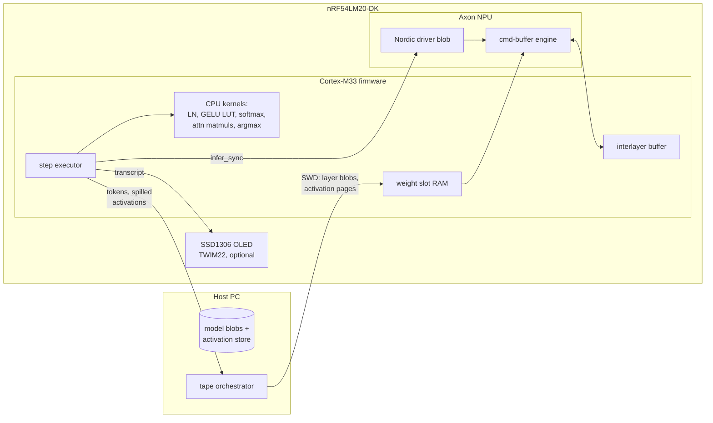

# Whisper — speech-to-text on the nRF54LM20-DK Axon NPU, one layer at a time

An attempt to run OpenAI Whisper (tiny.en, 39M parameters) on a chip with
2 MB flash and 510 KB usable RAM. The model is ~37 MB as int8, so it can
never be resident: the host acts as backing store and streams the model
through the device **layer by layer**. Each transformer sub-layer is compiled
offline into an Axon command-buffer blob; the firmware loads blobs into a
fixed RAM slot, runs them on the NPU, and executes the non-NPU glue on the
Cortex-M33.

This is a feasibility project, not a real-time transcriber: the debug link
(~0.5 MB/s) has to move ~10-30 MB of weights per generated token, so an
utterance takes minutes. The point is that it runs at all.

## The layer approach

The Axon NPU executes int8 TFLite models with a restricted op set (conv,
fully-connected, add, pool, ...) compiled offline into command buffers. No
dynamic matmuls, no layernorm, no softmax, no GELU. Whisper therefore splits
into:

| Piece | Where | Form |
|---|---|---|
| conv1, conv2 (mel frontend stem) | NPU | CONV_2D k=3, frame-tiled, conv2 output-channel-tiled |
| q/k/v/out projections (self + cross) | NPU | 1x1 CONV_2D over frame tiles (FC per frame) |
| mlp fc1 (384 -> 1536) | NPU | 4 output-channel tiles of 384 |
| mlp fc2 (1536 -> 384) | NPU | 4 input-dim partial models, partials summed on CPU |
| layernorm | CPU | f32, from/to quantized activations |
| GELU | CPU | exact 256-entry int8 LUT |
| attention QK^T, probs x V | CPU | int8 x int8 -> int32 (SMLAD), f32 softmax between |
| residual stream | CPU | int16 (int8 was not enough, see NOTES) |
| final logits projection | CPU | int8 x int8 -> int32, exact f32 logits, fused argmax |

Every NPU submodel is small enough for a ~192 KB RAM weight slot. Blobs are
linked offline at the slot's fixed address against the firmware ELF (the Axon
command buffers embed absolute buffer addresses), so at runtime a blob is
loaded into the slot and executed via the standard driver, no relocation.

The encoder runs on a truncated audio context (whisper.cpp's audio_ctx
trick): 12 s chunks -> 600 frames instead of 30 s -> 1500, sized so the
activations the device must hold stay within RAM.

## Layout

    model/      pixi project: reference, decomposition, quantization, export
        whisper_ref.py   canonical openai-whisper greedy decode (ground truth)
        layered.py       the layered engine: float / calib / int8 backends
        simulate.py      4-stage feasibility ladder (see below)
        export.py        int8 TFLite submodel emission for the Axon compiler
    firmware/   bare-metal Rust step executor: mailbox protocol, CPU glue
                kernels, runtime slot loader; reuses ../npu platform layer
        tools/make-blob.sh   Axon header -> runtime-loadable slot blob
    host/       probe-rs driver: flashes, streams blobs/activations over SWD,
                runs the golden-vector selftest (seed of the tape orchestrator)

## Status

- [x] M0 scaffolding
- [x] M1 numerical feasibility (host simulation)
- [x] Axon compiler accepts the submodel shapes (frames on the WIDTH axis;
      interlayer needs are small: FC tile 24 KB, conv tiles 30-58 KB, psum 0)
- [x] M2 core VERIFIED ON HARDWARE: a runtime-streamed Whisper layer blob
      (block-0 q-projection, 166 KB) loads into the RAM slot over SWD and
      runs on the Axon BIT-EXACT vs the TFLite interpreter (40 ms inference,
      74 KB/s streaming). Device activations are channel-planar [C][W].
- [x] Tape machinery: model/tape.py emits stage-isolated schedules (5
      generic ops) that host/ plays against the mailbox; goldens come from
      chained TFLite interpreters + kernel-exact numpy glue.
- [x] ENCODER BLOCK 0 fully verified on hardware: 25/25 stage checks
      (LN, q/k/v, 6 fused CPU attention heads, out-proj, residuals, tiled
      MLP with GELU LUTs and fc2 recombination), 12 streamed blobs, 65 s.
- [x] M3: THE FULL ENCODER VERIFIED ON HARDWARE at audio_ctx=600: conv
      stem (halo-tiled), positional embedding, all 4 transformer blocks
      (frame-tiled, per-head attention over 600 keys), final layernorm.
      1232/1232 stage checks within tolerance (worst deviation: 3 int16
      elements off by 1 LSB); 4458 steps, 52 blobs, 43 MB, 49 min.
      Submodels are calibrated on REAL recorded activations (random-data
      calibration saturated block-3's fc2 and destroyed accuracy; the
      per-stage SNR ladder in tape.py is the guard).
- [x] M4: FIRST ON-DEVICE TRANSCRIPT. The DK transcribed the JFK clip
      PERFECTLY: "And so my fellow Americans ask not what your country
      can do for you ask what you can do for your country." -- 23/23
      tokens matching the device-model prediction, greedy, 252 MB
      streamed through the slot, 58 min (~2.3 min/token, streaming
      bound). Token-rate submodels run at width 4 (pointwise conv
      minimum); the LM head (final LN + vocab projection) runs on the
      host in f32 from the int16 residual.
- [x] Mic + on-device log-mel: hardware-verified (mel bit-exact vs the
      mirror; the mirror matches whisper's own pipeline to 3e-5).
- [x] M5 BUILT, AWAITING SD HARDWARE TEST: the firmware is a complete
      standalone transcriber. At boot it waits 3 s for a host (tape and
      decode drivers still work), then: SD init -> record 12 s from the
      PDM mic -> log-mel -> full encoder -> cross K/V -> greedy decode
      with an on-device LM head over a 12230-token pruned vocabulary
      (GPT-2 BPE ids < 12288 minus whisper's suppress set) -> transcript
      printed over RTT, then it listens again. All weights/scratch on
      the card.
- [x] SPEED (built blind, see speedup.md): the SD card moved to SPIM00,
      the 32 MHz HS-SPI instance (4x the SPIM22 ceiling; card init is
      bit-banged because SPIM00 cannot clock below ~1 MHz), and mel pass
      1 now streams during the 12 s recording (chunk-sized PDM buffers,
      bit-exact vs the sequential pass, which stays as an automatic
      fallback if the M33 ever falls behind the mic). Expected effect:
      ~10 min -> ~3 min per utterance, decode ~18 -> ~5 s/token.
- [x] OPTIONAL OLED (built blind): an SSD1306 128x64 on TWIM22 (the
      serial box and P3 pins the SD card vacated) shows status and the
      transcript token by token in standalone mode. Probed at boot;
      absent hardware degrades to RTT-only output.

## Testing the standalone build (when the SD breakout is wired)

1. Wire a microSD breakout to the expansion board header P17. The card
   sits on SPIM00 (the 32 MHz HS-SPI instance; the SPIM2x instances top
   out at 8 MHz and cannot reach these pins):
       SCK  -> P2.01 (P17 pin 22)   MOSI -> P2.02 (P17 pin 23)
       MISO -> P2.04 (P17 pin 25)   CS   -> P2.05 (P17 pin 26)
   Board setup in nRF Connect's Board Configurator: route P2.00-P2.05 to
   the pin headers (by default the analog switches connect them to the
   on-board NOR flash), and set VDD:nRF to 3.3 V (SD cards need 2.7 V+;
   the default is 1.8 V).
   OPTIONAL: an SSD1306 128x64 I2C OLED shows the live transcript
   (probed at boot; everything works without it):
       SCL -> P3.03 (P17 pin 14)   SDA -> P3.02 (P17 pin 13)
2. Write the image (44 MB) with a USB reader:
       sudo dd if=model/out/sd.img of=/dev/sdX bs=4M conv=fsync
3. SD smoke test (round-trip + image magic):
       cd host && cargo run --release -- tape \
         ../firmware/target/thumbv8m.main-none-eabihf/release/whisper-firmware \
         ../model/out/tape-sdtest/tape.json
4. Host-driven decode with card-sourced weights (stage B, ~15 s/token):
       cargo run --release -- decode <elf> ../model/out/decoder-plan \
         ../model/out/blobs --sd
5. Fully standalone: flash with `cargo run --release` in firmware/, keep
   an RTT viewer attached (probe-rs attach), do not send any host
   command -- after 3 s the firmware goes standalone and starts
   listening. Speak during the 12 s window.

### M1 results (JFK clip, 11 s)

    stage 1  float, full ctx:      layered == openai-whisper (3.3e-5), transcript MATCH
    stage 2  float, audio_ctx=600: transcript correct (loses one comma)
    stage 4  int8 device semantics: transcript == stage 2, argmax margin >= 1.1 logits

The int8 pipeline transcribes the clip exactly: "And so my fellow Americans
ask not what your country can do for you ask what you can do for your
country." Calibration currently uses the test clip itself; a proper
calibration set is future work (see NOTES).

## Workflow

    cd model
    pixi run reference    # download tiny.en, canonical transcribe, ref.npz
    pixi run simulate     # 4-stage ladder, writes out/scales.json
    pixi run export       # emit int8 tflite submodels + golden vectors
    # Axon-compile a submodel (uses the npu project's container):
    INSTALL_DIR=$PWD/out/axon-headers \
      ../../npu/tools/compile-model.sh out/submodels/wq0.tflite wq0 131072 32768

    cd ../firmware
    cargo build           # the step executor (no model linked at build time)
    tools/make-blob.sh ../model/out/axon-headers/nrf_axon_model_wq0_.h \
      target/thumbv8m.main-none-eabihf/debug/whisper-firmware \
      ../model/out/blobs/wq0.bin

    # With the DK attached: flash + stream the blob + run + compare
    cd ../host
    cargo run --release -- \
      ../firmware/target/thumbv8m.main-none-eabihf/debug/whisper-firmware \
      ../model/out/blobs/wq0.bin \
      ../model/out/submodels/wq0.input.bin ../model/out/submodels/wq0.expect.bin

Blobs embed absolute addresses resolved against the firmware ELF: regenerate
them (make-blob.sh) after every firmware change.

## Dependencies on sibling projects

- `../npu/` — Axon driver blob, headers, and the containerized Axon compiler.
- `../PDM-MIC/` — mic capture + host probe-rs plumbing (M5).
- `../KWS/` — hardware-validated platform layer and selftest patterns.
